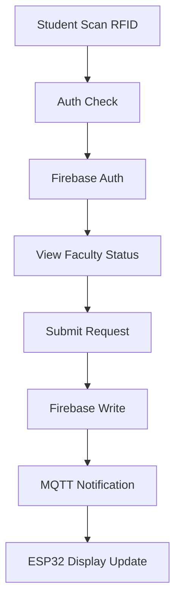

# Product Context
*Last updated: 2023-07-15*  

## Problem Space
- Current manual systems cause 40% consultation delays  
- No real-time faculty availability tracking  
- Student-Faculty meeting success rate: 62%  

## User Flow

## Success Metrics
1. Reduce consultation setup time by 70%
2. Achieve 95% status accuracy
3. Support 500+ concurrent users

## User Personas

### Student (Primary User)
- **Needs**: Quick faculty availability info, streamlined consultation requests
- **Pain Points**: Wasted trips to empty offices, scheduling conflicts
- **Goals**: Efficient academic support, minimal waiting time

### Faculty Member
- **Needs**: Automated presence tracking, organized consultation requests
- **Pain Points**: Interruptions during focused work, missed student meetings
- **Goals**: Balance availability with productivity, improved student support

### Administrator
- **Needs**: System oversight, faculty management, usage analytics
- **Pain Points**: Manual record keeping, lack of visibility into system usage
- **Goals**: Efficient resource allocation, improved faculty-student interaction

## Key Use Cases

1. **Student Consultation Request**
   - Student scans RFID card at central system
   - Views real-time faculty availability
   - Submits consultation request with topic details
   - Receives notification when faculty acknowledges

2. **Faculty Presence Detection**
   - BLE beacon (carried by faculty) enters office range
   - ESP32 unit detects presence and updates status
   - Central system reflects updated availability
   - Students see real-time status changes

3. **Admin Management**
   - Admin logs into secure interface
   - Manages faculty profiles and permissions
   - Views consultation analytics and system logs
   - Configures system parameters and notifications

// File version: 1.1-firebase
