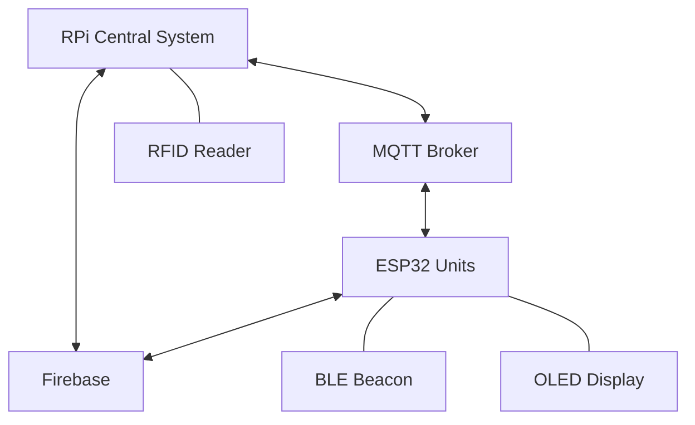
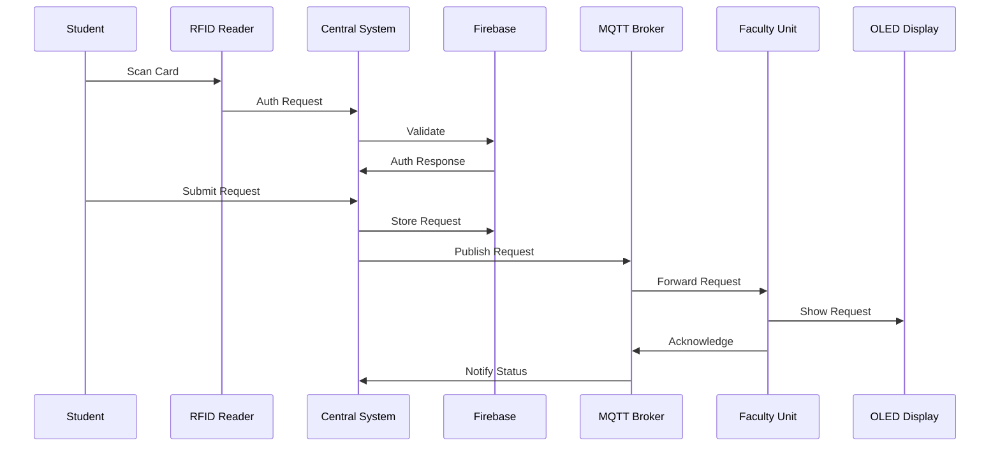

# System Patterns
*Last updated: 2023-07-15*

## Component Architecture

## Event Flow

## Key Technical Decisions

1. **PyQt over Web Interface**: 
   - Touch-optimized native UI for smoother experience
   - Direct hardware access for RFID integration
   - Lower latency for status updates

2. **MQTT for Real-time Communication**:
   - Low latency (<50ms) message delivery
   - Pub/sub pattern matches notification requirements
   - QoS levels for guaranteed delivery
   - Retain flag for stateful updates

3. **Firebase for Database**:
   - Real-time synchronization
   - Built-in auth system
   - Offline capabilities
   - Cross-device consistency

4. **BLE for Presence Detection**:
   - Lower power consumption than WiFi
   - Sufficient range for office environment (5-10m)
   - Periodic advertising packets for presence tracking

## Data Models

1. **Faculty**:
   - Properties: faculty_id, name, department, email, phone, office, status, ble_beacon_id
   - Emits signals: data_changed, status_changed
   - Methods: to_dict(), from_dict()

2. **Student**:
   - Properties: student_id, name, program, year_level, email, phone
   - Methods: to_dict(), from_dict()

3. **Consultation Request**:
   - Properties: request_id, student_id, faculty_id, topic, timestamp, status
   - Status workflow: pending → acknowledged → completed/cancelled
   - Methods: to_dict(), from_dict()

## Failure Modes & Recovery

1. **RFID Reader Timeout**:
   - Detection: No response within 2s
   - Recovery: Auto-retry 3x, then prompt manual entry

2. **MQTT Disconnect**:
   - Detection: Connection lost event
   - Recovery: Exponential backoff reconnect, offline queue

3. **Firebase Offline**:
   - Detection: Connection state change
   - Recovery: Local persistence, background sync on reconnect

4. **BLE Beacon Missing**:
   - Detection: No advertisements for 5 minutes
   - Recovery: Mark as "unknown" status, alert admin

// File version: 1.3-models
